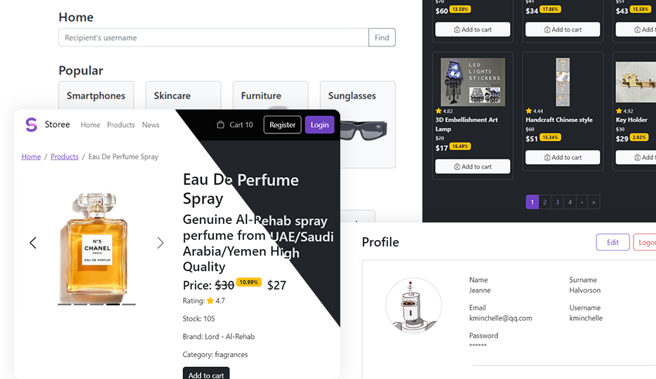

# About Storee project
Webstore. SPA on react, formik, bootstrap. API based on dummyjson.

## Instruments
- create-react-app
- React-router
- Formik
- Bootstrap
- jest
- react-testing-library
- webdriverio

## How to try
You need any cli (cmd, iterm, ...), npm, git on your pc.
1. Open your cli
1. Paste `git clone https://github.com/bakhtyiar/Storee-shop.git` and enter
1. Paste `cd Storee-shop` and enter
1. Paste `npm i` and enter
1. Paste `npm start` and enter
2. Wait minute for build
